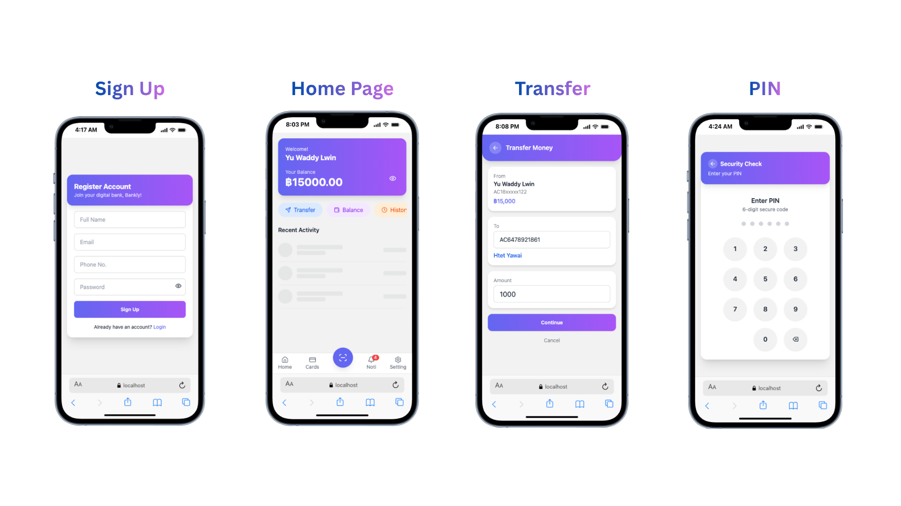
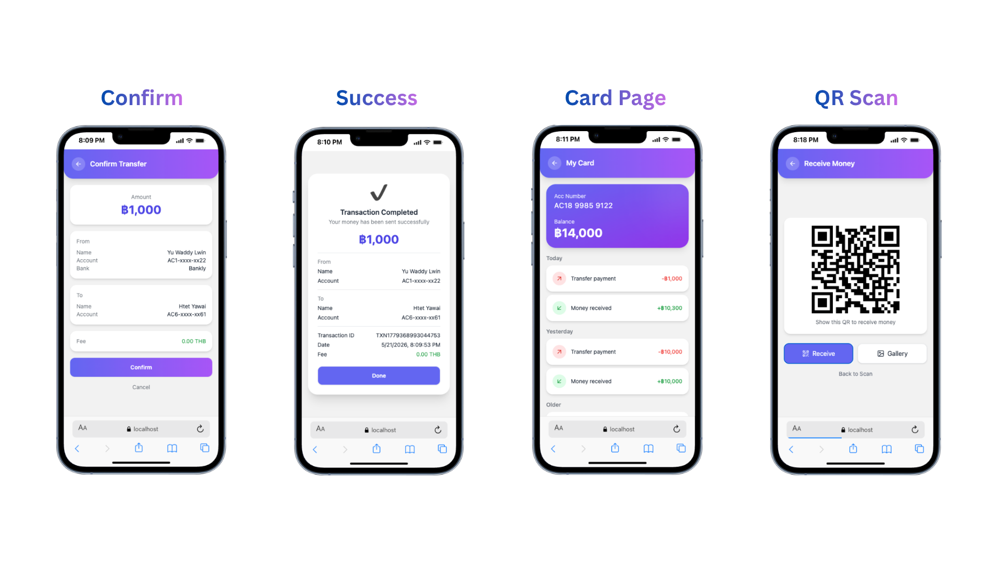
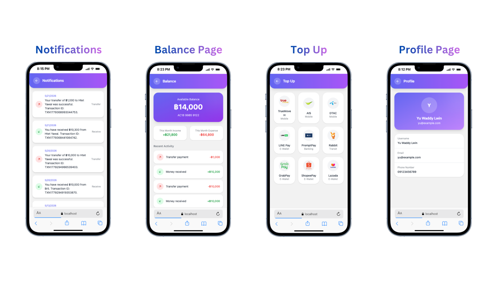

# 💳 Bankly

Bankly is a full-stack digital banking web application built to simulate modern mobile banking features with secure authentication, money transfers, QR payments, and transaction tracking.

## Project Demo
[Demo Video](https://www.linkedin.com/posts/yuwaddylwin_mern-reactjs-nodejs-ugcPost-7463252017403035648-z-M8?utm_source=share&utm_medium=member_ios&rcm=ACoAAF0W0zcBYgZLv3GKti5jmF3By9n0mvFIlsE)

## 📸 App Screenshots

---

## 📌 Overview

Bankly enables users to:
- Create and manage secure bank accounts
- Transfer money between accounts
- Verify transactions using a secure PIN system
- Track balances and transaction history
- Receive real-time notifications
- Scan QR codes to receive payments
- Top up mobile wallets and e-wallet services

This project focuses on secure banking workflows, responsive mobile-first UI/UX, and real-world full-stack application development.

## Tech Stack

### Frontend
- React
- Tailwind CSS
- DaisyUI
- Axios

### Backend
- Node.js
- Express.js
- MongoDB & Mongoose

### Authentication & Security
- JWT (JSON Web Tokens)
- bcrypt password hashing
- Protected routes

---

## ✨ Features

- Secure authentication and authorization
- Money transfer with transaction confirmation
- Secure 6-digit PIN verification
- Mobile-first responsive banking UI
- Transaction notifications and history
- Card and balance management
- QR code payment and receive system
- Optimized backend APIs and database operations
